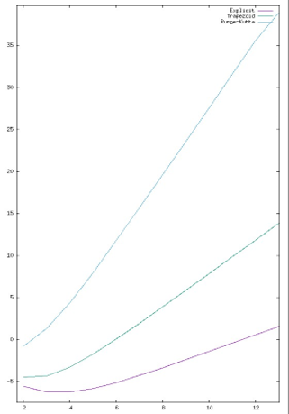
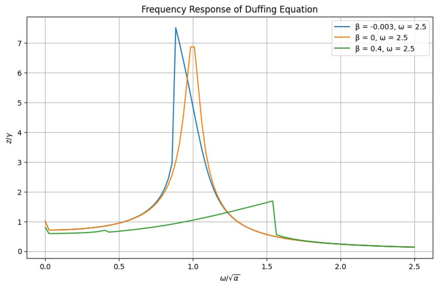
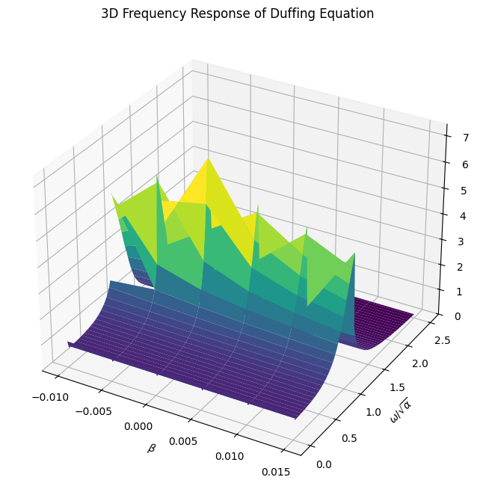

# PINN (Physics-Informed Neural Networks)

This project attempts to solve *Duffing equation* using **PINN** and numerical methods.

## Project goals

* Implement [PINN](https://en.wikipedia.org/wiki/Physics-informed_neural_networks)
  method for solving [Cauchy problem](https://en.wikipedia.org/wiki/Cauchy_problem)
  of [Duffing equation](https://en.wikipedia.org/wiki/Duffing_equation)
* Compare results with numerical methods
* Research relation between behaviour of system and its parameters

## Task formulation

**[Duffing equation](https://en.wikipedia.org/wiki/Duffing_equation)**\
$` \frac{d^2x}{dt^2}+\delta \frac{dx}{dt} + \alpha x + \beta x^3 = \gamma \cos(\omega t), \quad t>0 `$

*Cauchy data* of the problem - $` x(0) = x_0, \frac{dx}{dt}(0) = v_0 `$

*Parameters* of equation - $`\alpha, \beta, \gamma, \delta, \omega`$

## Numerical methods

3 numerical methods were implemented:

* [Euler method](https://en.wikipedia.org/wiki/Euler_method) (first-order numerical procedure)
* [Trapezoidal method](https://en.wikipedia.org/wiki/Trapezoidal_rule) (second-order numerical procedure)
* [Runge-Kutta method](https://en.wikipedia.org/wiki/Runge%E2%80%93Kutta_methods) (fourth-order numerical procedure)

Numerical methods were tested on the following differential equation with analytic
solution - $` \ddot x + \alpha x = 0 \left(x_0 = 1, v_0 = 0, t_0 = 0\right) `$

Log-log plot of numerical methods errors



## PINN

For approximating equations whose solution is unknown,
conventional types of neural networks are not applicable -
it is impossible to calculate the error of prediction.

[PINN](https://en.wikipedia.org/wiki/Physics-informed_neural_networks)
is a type of neural network for approximating differential equations that has a special error function -
it is calculated by substituting the predicted values into the original differential equation,
taking into account Cauchy data of the equation.

$`
LOSS = \frac{1}{N} \sum_{i=1}^{N}
(x''_i + \delta x'_i + \alpha x + \beta x_i^3 - \gamma \cos \left( \omega t_i \right))) +
\lambda \left(\left(x(0) - f(0)\right)^2 + \left(x'(0) - f'(0)\right)^2 \right)
`$

### Neural network configurations

There were 3 configurations of neural network that were tested during research.

Training of models for tests was performed for 256 epochs.

#### Configuration №1

|                     | Layer 1 | Layer 2 | Layer 3 | Layer 4 | Layer 5 | Layer 6 |
|:--------------------|:-------:|:-------:|:-------:|:-------:|:-------:|:-------:|
| Neurons             |   32    |   32    |   32    |   32    |   32    |    1    |
| Activation function |  `sin`  |  `sin`  | `tanh`  | `tanh`  |  `sin`  |  `id`   |

| Max error |  MSE   |
|:---------:|:------:|
|   0.068   | 1.8e-7 |

#### Configuration №2

|                     | Layer 1 | Layer 2 |  Layer 3   | Layer 4 | Layer 5 | Layer 6 |
|:--------------------|:-------:|:-------:|:----------:|:-------:|:-------:|:-------:|
| Neurons             |   32    |   32    |     32     |   32    |   32    |    1    |
| Activation function |  `sin`  | `tanh`  | `softplus` | `tanh`  |  `sin`  |  `id`   |

| Max error |   MSE   |
|:---------:|:-------:|
|   0.059   | 1.39e-7 |

#### Configuration №3

|                     | Layer 1 | Layer 2 |  Layer 3   | Layer 4 | Layer 5 | Layer 6 |
|:--------------------|:-------:|:-------:|:----------:|:-------:|:-------:|:-------:|
| Neurons             |   64    |   64    |     64     |   64    |   64    |    1    |
| Activation function |  `sin`  | `tanh`  | `softplus` | `tanh`  |  `sin`  |  `id`   |

| Max error |   MSE   |
|:---------:|:-------:|
|   0.054   | 1.18e-7 |

## Research of parameters

By setting some parameters of the Duffing equation to zero,
it is transformed into the equations of already
known [oscillatory systems]((https://en.wikipedia.org/wiki/Harmonic_oscillator)).

Thus, it is possible to identify influence of the equation parameters
on the behavior of the oscillator using said method.

### $` \alpha `$ parameter

For given parameters $` \beta = \delta = \gamma = \omega = 0 `$,
the Duffing equation describes simple harmonic oscillations - $` \ddot x + \alpha x = 0 `$.

We can conclude that $` \alpha `$ defines linear stiffness of oscillator.

#### Plots and phase portraits

|                 $` \alpha = 1 `$ plot                 |                      $` \alpha = 1 `$ phase portrait                      |
|:-----------------------------------------------------:|:-------------------------------------------------------------------------:|
|  |  |

|                 $` \alpha = 0 `$ plot                 |
|:-----------------------------------------------------:|
|  |

|                 $` \alpha = -3 `$ plot                  |                      $` \alpha = -3 `$ phase portrait                       |
|:-------------------------------------------------------:|:---------------------------------------------------------------------------:|
|  |  |

### $` \delta `$ parameter

For given parameter $` \beta = 0 `$,
the Duffing equation describes damped oscillations - $` \ddot x + \delta \dot x + \alpha x = 0 `$.

We can conclude that $` \delta `$ represents degree of oscillation damping.

#### Plots

|                  $` \delta = 0.5 `$ plot                  |
|:---------------------------------------------------------:|
|  |

|                  $` \delta = 0.03 `$ plot                   |
|:-----------------------------------------------------------:|
|  |

### $` \beta `$ parameter

For given parameter $` \gamma = 0 `$,
the Duffing equation describes non-linear dynamic oscillation system -
$` \ddot x + \delta \dot x + \alpha x + \beta x^3 = 0 `$.

We can conclude that $` \beta `$ represents degree of non-linearity of driving force.

#### Plots and phase portraits

After some research, it was discovered that if $` \beta `$ parameter is non-null,
PINN has serious problems with approximating Duffing equation.

This is due to the fact that this coefficient has a decisive influence
on the possibility of the system transitioning to a state of dynamic chaos,
and also affects the non-linear properties of the system.

|                   $` \beta \neq 0 `$ plot                    |                        $` \beta \neq 0 `$ phase portrait                         |
|:------------------------------------------------------------:|:--------------------------------------------------------------------------------:|
|  |  |

$` \beta `$ parameters also impose problems on numerical methods, but
since we can specify arbitrary precision and
choose different methods decent approximation is still possible.

#### Stability of solutions

Although $` \beta `$ parameter severely complicates equation,
we can still research its behaviour using knowledge
from [Stability theory](https://en.wikipedia.org/wiki/Stability_theory).

[Hooke's law](https://en.wikipedia.org/wiki/Hooke%27s_law) for linear oscillation system -
$` F = - \alpha x `$.
Transformed version of that law - $` F = - \alpha x - \beta x^3 = -x \left(\alpha - \beta x^2 \right) `$.

Now it is possible to identify equilibrium points - points at which $` F = 0 `$.

Zero is always an equilibrium point; but if $` \alpha \lt 0 `$ or
$` \beta \lt 0 `$ with big enough `x` value, then zero is unstable point,
otherwise it is asymptotically stable.
If there is a real solution for the $` \left(\alpha - \beta x^2 \right) = 0 `$ equation,
then that solution is an asymptotically stable point.

|                              $` \alpha \lt 0 `$, $` \beta \gt 0 `$ phase portrait                               |
|:---------------------------------------------------------------------------------------------------------------:|
|  |

|                                $` \alpha \gt 0 `$, $` \beta \gt 0 `$ phase portrait                                |
|:------------------------------------------------------------------------------------------------------------------:|
|  |

### $` \gamma `$ and $` \omega `$ parameters

For given parameter $` \delta = 0 `$,
the Duffing equation describes driven oscillation system -
$` \ddot x + \alpha x + \beta x^3 = \gamma \cos \left( \omega t \right) `$.

We can conclude that $` \gamma `$ represents amplitude of periodic driving force and
$` \omega `$ represents angular frequency of a periodic driving force.

#### Plots

|                      $` \gamma = 1.5 `$, $` \omega = 1.2 `$ plot                       |
|:--------------------------------------------------------------------------------------:|
|  |

|                      $` \gamma = 0.5 `$, $` \omega = 0.5 `$ plot                       |
|:--------------------------------------------------------------------------------------:|
|  |

### General form of the equation

When all parameters are non-null
($` \frac{d^2x}{dt^2}+\delta \frac{dx}{dt} + \alpha x + \beta x^3 = \gamma \cos(\omega t), \quad t>0 `$),
we can research behaviour of Duffing equation by examining its
[frequency response](https://en.wikipedia.org/wiki/Frequency_response).

If non-linearity is neglected,
the Duffing equation becomes a non-homogeneous linear differential equation,
the solution of which can be sought in the form
$` x = a \cos \left( \omega t \right) + b \sin \left( \omega t \right) = A \cos \left( \omega t - \varphi_0 \right) `$.

Substituting that solution into the original equation,
we find relation between coordinate amplitude and angular frequency of a periodic driving force -
$` \left[ \left( \omega^2 - \alpha - \frac{3}{4} \beta A^2 \right) + \delta^2 \omega^2 \right] A^2 = \gamma^2 `$.

#### Plots

|                      2D frequency response                      |
|:---------------------------------------------------------------:|
|  |

|                      3D frequency response                      |
|:---------------------------------------------------------------:|
|  |

#### Chaos state

The frequency response is directly related to
the [frequency hysteresis](https://en.wikipedia.org/wiki/Hysteresis)
and bifurcations of the dynamic system.

Previous analysis assumed that the oscillator's natural frequency dominates
and the non-linearity of the restoring force is negligible.
If the driving force is strong enough, the system's behavior will be chaotic.

|                                  $` \alpha = -1 `$, $` \beta = 1 `$, $` \gamma = 0.5 `$, $` \delta = 0.3 `$, $` \omega = 1.2 `$ plot                                  |                                      $` \alpha = -1 `$, $` \beta = 1 `$, $` \gamma = 0.5 `$, $` \delta = 0.3 `$, $` \omega = 1.2 `$ phase portrait                                       |
|:---------------------------------------------------------------------------------------------------------------------------------------------------------------------:|:----------------------------------------------------------------------------------------------------------------------------------------------------------------------------------------:|
|  |  |

## Conclusion

After working and doing research with PINN I have come up with following conclusions:

* Implementing PINN is much harder than implementing numerical methods
due to non-deterministic nature of neural networks.
It is hard to come up with reliable configuration that will fit the task,
and there are no guarantees that
there is no corner case that neural network will fail to handle.

* Training of neural networks takes more time than approximation with numerical methods even for small steps,
even with GPU usage.

* One advantage of neural networks over numerical methods is that function that they produce is continuous,
and you are not constrained to the grid of coordinates.
That is not a big advantage, since you can just take mean value for point between grid points (basically trapezoid method).

All in all, although physics-informed neural networks are an interesting extension of common neural network architecture,
their application is somewhat questionable due to several downsides of neural networks.
Most of the time you are better off using simple and reliable numerical methods for fast prototyping and research.

## Usage of project

Although this project has no interactive component,
you can still use it to try out PINN and to do your own research of Duffing equation.

[constants.py](constants.py) file contains definitions of equation parameters, which you can change.
[main.py](main.py) initializes all systems and runs training of neural network.
It also tries to obtain true solution of your equation:

```python
real_solution = duffing.harmonic_oscillator(t.to(DEVICE))
```

True solution is needed to record metrics of neural network and numerical solution.

Since you do not know true solution for most of the configurations of parameters,
you might want to pass anything that resembles true solution and just ignore metrics like `MSE` and `max error`,
but if you know analytic solution you can substitute it
([duffing.py](duffing.py) comes with some solutions for cases that were described in this research).

After that, you are good to go with your research.

## Contributions

Feel free to star this repository if you liked my research or if you are interested in it;
in case of latter you are also welcome to contact me with your suggestions or questions.
